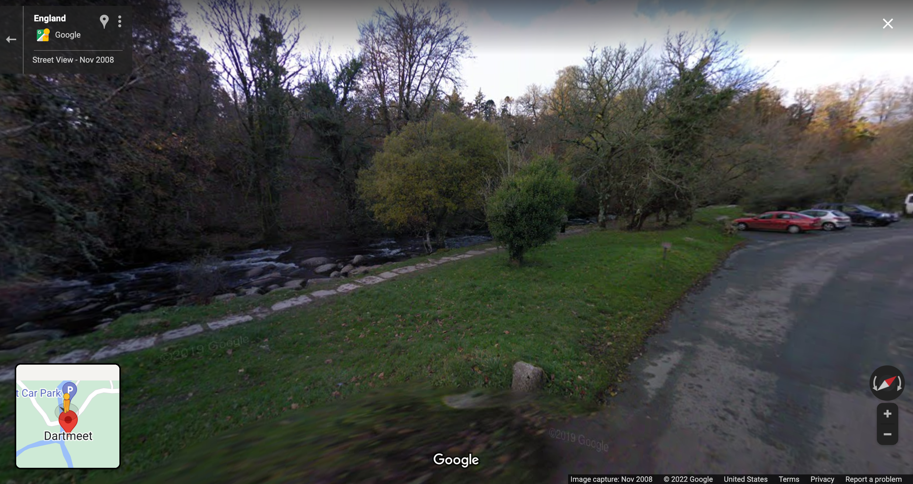
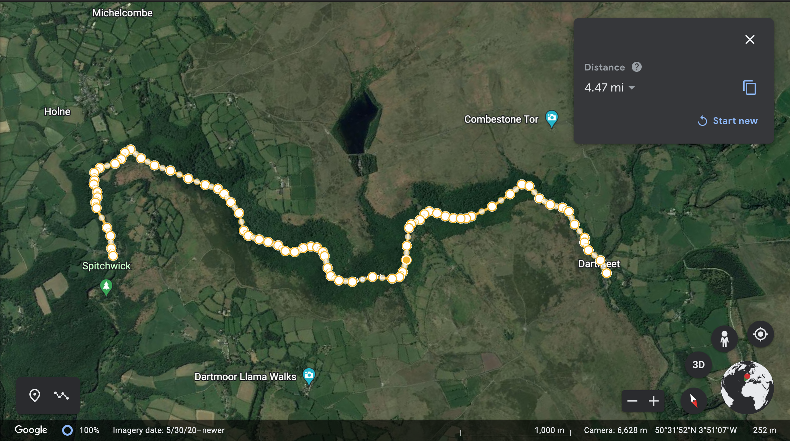

# River Dart Investigation

---

- [River Dart Investigation](#river-dart-investigation)
  - [Question](#question)
  - [Objective of the study](#objective-of-the-study)
  - [Data collection methods](#data-collection-methods)
  - [Health and Safety](#health-and-safety)
  - [Location](#location)
    - [Choosing a Location](#choosing-a-location)
    - [Locations Chosen](#locations-chosen)
  - [Data](#data)
  - [Analysis of Data](#analysis-of-data)

---

## Question

Does the velocity, width, depth and discharge decrease as the river flows downstream?

## Objective of the study

Successfully measure the velocity, width, depth, and discharge of the River Dart in 3 different places, Newbridge Car Park, the River Dart Country Park, and Dartmeet.

## Data collection methods

We will use a velocity meter to measure the river's velocity in the middle, by the left bank, and by the right bank. We would then find the average of these results to be more accurate. We will then measure the width of the river with a measuring tape. We can measure it in 5 different places at 1-metre intervals to get a more accurate result. We can then measure the depth using metre sticks along the river's bed. We can then use the depth, width and velocity to calculate the river discharge. We would do this at each site to find whether our hypothesis was correct.

## Health and Safety

To ensure that no accidents occur during the investigation, everyone will be required to wear welly boots to prevent people from slipping. In addition, when using the velocity meter, the person in charge of holding it will ensure the propellers do not cut anyone.

## Location

### Choosing a Location

When choosing a river, it is essential to remember the following points.

Places where the river is on private land cannot be easily accessed. Furthermore, it is impossible to access the river if it is behind a fence. Lastly,  the river must not be too deep or too fast to stand in any place that can be accessed. These criteria mean that our potential sites are limited to public places such as parks, or places where it is possible to access the river close to the road, such as the River Dart Country Park and the Newbridge Car Park, respectively.

### Locations Chosen

We will measure at the following sites:

1. Dartmeet
2. Newbridge Car Park
3. River Dart Country Park

The reason for choosing these locations is that they all fit the criteria above.

Dartmeet is a popular tourist location where the East and West Dart meet.

Newbridge Car Park is a carpark on the side of a road by a bridge over the Dart.

The River Dart Country Park is a park that is popular with families as children can quite safely play in the river.

The sites are not very far apart; however, they are all a few miles from each other along the river, which should be far enough to prove or disprove the hypothesis.

The distance from the River Dart Country Park to Newbridge Car Park is around 3.55 miles. The distance from Dartmeet to Newbridge Car Park is 4.47 miles.

Here are some image of the sites and distances between them:

Image of the site at Dartmeet:

Image of the site at Newbridge Car Park:

Image of the site at the River Dart Country Park:

Dartmeet to Newbridge Car Park:

Newbridge Car Park to the River Dart Country Park:

We will move between the sites by car or bus. This way the travel can be quick and safe.

## Data

|           Site          | Width | Depth | Velocity |   Discharge  |
|:-----------------------:|:-----:|:-----:|:--------:|:------------:|
|         Dartmeet        |  12M  |  0.3M |  1.5M/S  |  5.4 cumecs  |
|    Newbridge Car Park   |  16M  |  0.4M |   2M/S   | 15.36 cumecs |
| River Dart Country Park |  20M  |  0.5M |   3M/S   |   30 cumecs  |

## Analysis of Data

Our data shows that the width, depth, velocity and discharge of the river increase as the river flows downstream. This is likely due to the reasons that all rivers increase in these factors as they flow downstream. The river bed is eroded by hydraulic action, abrasion, and other forms of erosion. This deepens the river. The river banks are also eroded due to the same erosion on the banks.
